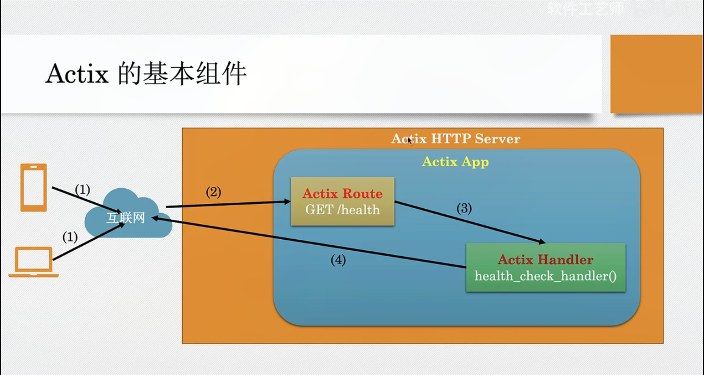
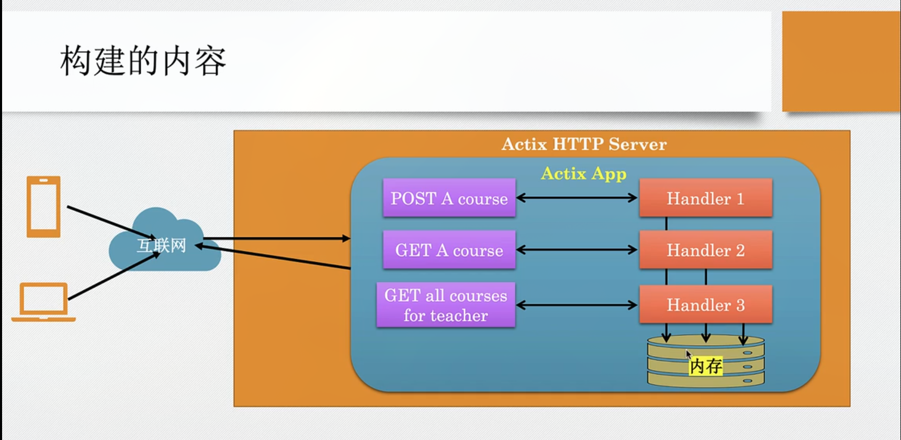
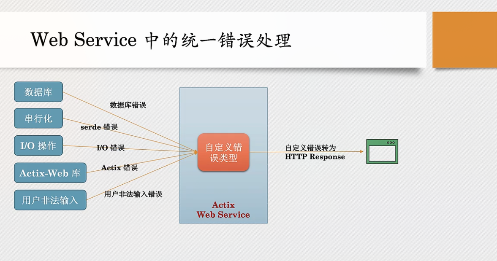

# Actix Web Server



- `Actix-Http-Server` 实现了 Http 协议
- `Actix-Http-Server` 内可以开启 `Actix-App`
- 当`App` 接受到请求之后会交给 `Actix-Route` 来分发路由到具体的 `Actix-Handler`
- `Actix-Handler` 处理好请求之后会返回 `Actix-Response` 给客户端

## 异步线程

`Actix` 默认会开启多线程来处理请求

- `Actix` 支持两类的并发
  - 异步`IO`, 给定的 `OS` 原生线程在等待 `I/O` 时执行其他任务(例如侦听网络连接)
  - 多线程并行: 默认情况下启动`OS` 原生线程的数量与系统逻辑 `CPU` 数量相同

## Restful Api



- `POST /courses`  创建一个课程
- `GET /courses/teacher_id` 获取某个老师的所有课程
- `GET /courses/teacher_id/course_id` 获取某个老师的某个课程

## sqlx 连接数据库

- [sqlx](https://docs.rs/sqlx/latest/sqlx/macro.query_as.html)

## 错误处理

- 

- 程序中产生的各种错误, 被转换为一个统一的自定义异常类型
- 这个统一的自定义类型会转换为对用户友好的提示信息和状态码
- 转换为统一的数据结构 HttpResponse 返回

---

- 编程语言常用的错误处理方式:
  - 异常
  - 返回值
- Rust 希望开发者显式的处理错误, 因此，可能出错的函数返回 Result 枚举类型，其定义如下:

```rust
enum Result<T, E> {
  Ok(T),
  Err(E),
}
```

- Result<T, E> 的 T 表示成功的返回值，E 表示失败的返回值

使用 `?` 传播错误

- 在某个函数中使用`?` 运算符, 该运算尝试从 Result 中获取值：
  - 如果不成功，它会接受 Error, 中止函数执行，并把错误传播到调用该函数的函数

```rust
fn square(val: &str) -> Result<i32, ParseIntError> {
  // match val.parse::<i32>() {
  //   Ok(num) => Ok(num.power(2)),
  //   Err(e) => Err(e),
  // }
  let num = val.parse::<i32>()?;
  Ok(num.power(2))
}
```
### 自定义错误

- 创建一个自定义错误类型，他可以是多种错误类型的抽象(更符合实际业务场景)
- 例如 

```rust
#[derive(Debug)]
pub enum MyError {
  ParseError,
  IOError,
}
```

### Actix-web 处理错误

- Actix-web 中将错误转换为 HttpResponse

- Actix-web 定义了一个通用的错误类型(struct): `actix_web::error::Error`
  它实现了 `std::error::Error` trait,
- 任何实现了标砖库 `Error Trait` 的类型，都可以通过 `?` 运算符，转换为
  `Actix` 的 `Error` 类型
- `Actix` 的 `Error` 类型会自动的转化为 `HttpResponse`, 返回给客户端

- `ResponseError trait` 任何实现该 `trait` 的错误都可转换为 `HttpResponse` 消息
- 内置的实现: `actix-web` 对以常见的错误有内置的实现，例如  
  - Rust 标准的 `I/O` 错误
  - Serde 错误
  - Web 错误,例如: `ProtocolError`, `Utf8Error`, `ParseError` 等
- 其他的错误类型: 内置实现不满足需求时候，需要自定义实现错误到 `HttpResponse` 的转换

### 创建自定义的错误处理器

- 创建一个自定义的错误类型
- 实现 `From trait`, 将其他的错误类型转换为自定义类型
- 为自定义错误类型实现 `ResponseError trait`
- 在 handler 里返回自定义错误类型
- Actix 会把错误转换为 Http 响应
