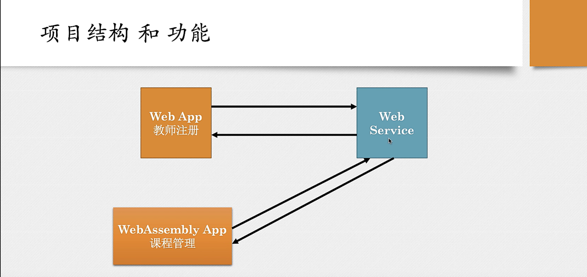

# Web Assemble



Web Assembly 是一种新的编码方式，可以在现代浏览器中运行，

- 它是一种低级的类汇编语言
- 具有紧凑的二进制格式
- 可以接近原生的性能运行
- 并为 C/C++, C#, Rust 等语言提供一个编译目标，以便它们可以在 Web 上运行
- 它被设计为可以与 `javascript` 共存，允许两者之间的协同操作

---

- 硬件设备执行的都是机器码，而汇编语言是最接近机器码的一种语言
- 不同的机器的CPU架构不同，执行的机器码,和汇编也不一
- 高级编程语言可以通过 `翻译` 成机器码，以便可以在CPU上执行, 不同的CPU 架构使用不同的编译器即可编译出对应的机器码

---

- web assemble 其实不是汇编语言，它不针对特定的机器，而是正对浏览器的
- web assemble 是中间编译器目标

## Web Assemble 的格式

- 文本格式 `.wat`

```webassemble
(module
  (func $addTwo (param i32 i32)
    (result i32)
    (i32.add
      (get_local 0)
      (get_local 1)
    )
  )
  (export "addTwo" $addTwo)
(
```

- 二进制格式 `.wasm`

```webassemble
48 83 EC 08
8B CF
8B C1
03 C6
66 90
48 83 C4 08
C3
```

## Web Assembly 可以做什么

- 可以把任何的 C/C++, C#, Rust 等语言的代码编译为 WebAssembly 模块
- 你可以在 web 应用中加载该模块，并通过在 `Javascript` 来调用它
- 它并不是为了替代 Js, 而是与 JS 一起工作
- 仍然需要 js 和 Html, 因为 web Assembly 无法访问平台 Api, 例如Dom. WebGL

## Web Assembly 的优势

- 快速，高效，可移植
  - 通过利用常见的硬件能力，WebAssembly 代码在不同的平台上能够以接近本地速度运行
- 可读，可调试
  - WebAssembly 是一门低阶语言，但是它又确实又一种人类可读的文本格式(其标准最终版本仍在编制)
    这允许通过手工来写代码，看代码以及调试代码。
- 保持安全
  - WebAssembly 被限制运行在一个安全的沙箱执行环境中，像其他的网络代码一样
    它遵循浏览器的同源策略和授权策略。
- 不破坏网络
  - WebAssembly 的设计原则是与其他网络技术和谐共处并保持向后兼容

## 环境搭建

- [Rust And WebAssembly](https://rustwasm.github.io/docs/book/)
- [安装wasm](https://rustwasm.github.io/wasm-pack/installer/)

```bash
curl https://rustwasm.github.io/wasm-pack/installer/init.sh -sSf | sh
```

- 安装

```bash
cargo install cargo-generate
```

- 使用模板创建项目

```bash
cargo generate --git https://github.com/rustwasm/wasm-pack-template 
```

### 项目说明

- `Cargo.toml` 文件说明

```toml

[package]
name = "webwasm"   # 这个名称很重要，前端需要引入这个项目名称作为前端构建打包的一部分
version = "0.1.0"
authors = ["ancion <ancion@github.com>"]
edition = "2018"

[lib]
crate-type = ["cdylib", "rlib"]  # 构建的项目库的类型, 不同的系统平台可能不同

[features]
default = ["console_error_panic_hook"]

[dependencies]
wasm-bindgen = "0.2.84"  # 绑定 wasm 与 浏览器相关的 api 和对象，整个 rust 与 wasm 之前的桥梁核心

# The `console_error_panic_hook` crate provides better debugging of panics by
# logging them with `console.error`. This is great for development, but requires
# all the `std::fmt` and `std::panicking` infrastructure, so isn't great for
# code size when deploying.
console_error_panic_hook = { version = "0.1.7", optional = true }

[dev-dependencies]
wasm-bindgen-test = "0.3.34"

[profile.release]
# Tell `rustc` to optimize for small code size.
opt-level = "s"
```

- 实例代码 `lib.rs`

```rust

// 直接导入 wasm_bindgen 的预导入模块，这样 js 和 wasm 之间才能绑定
use wasm_bindgen::prelude::*;

// wasm_bindgen 这个 attribute 告诉 rust compiler 这个函数是 rust 可以调用的外部函数，
// 代码运行在浏览器中时这个外部调用将是有效的
#[wasm_bindgen]
extern "C" {
    // 前端部分的 api 调用需要在这个 abi 规范中进行定义后才能调用
    fn alert(s: &str);
}

// 这个函数是可以在 js 中调用
#[wasm_bindgen]
pub fn greet() {
    alert("Hello, webwasm!");
}
```

- 构建代码

```bash
wasm-pack build --release
```

项目下生成 `pkg` 目标文件夹

```bash
webwasm/pkg
├── package.json       # 记录包的一些元信息，例如当前库的名称，版本等信息
├── webwasm.js         # 导出模块到 js 中，导入 rust api 到浏览器的胶水代码
├── webwasm_bg.js      # 导出 rust api 到浏览器的胶水代码
├── webwasm.d.ts       # 导出到 TS 的函数或者类型的定义
├── webwasm_bg.wasm.d.ts       
└── webwasm_bg.wasm    # 编译生成的 wasm 二进制代码
```

### 前端引入

- 使用模板生成一个前端的 wasm-app 项目

```bash
npm init wasm-app wasmapp --typescript
```

---

- 在生成的项目中的 `package.json` 将 wasm 项目添加到依赖中，

```json
{ 
  ...
  "dependencies": {
    "webwasm": "file:../pkg"
  }
  ...
}
```

- 使用命令安装依赖(每次 webwasm 项目代码变更编译后都需要执行重新安装，前端的项目才能正常的使用)

```bash
npm install 
```
